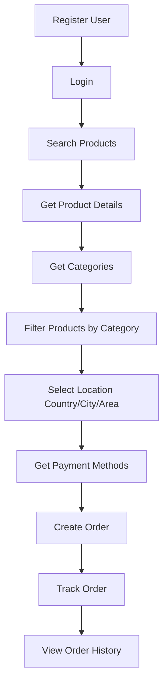

# Pharma E-Commerce API - Postman Collection Guide

## Overview

This Postman collection contains all API endpoints for the Nuxt Pharma E-Commerce application. The collection is organized into logical folders for easy navigation and testing.

## Quick Start

### 1. Import the Collection

1. Open Postman
2. Click on **Import** button
3. Select the `Pharma-Ecommerce-API.postman_collection.json` file
4. The collection will be imported with all endpoints

### 2. Environment Variables

The collection uses the following variables:

| Variable       | Default Value                                              | Description                             |
| -------------- | ---------------------------------------------------------- | --------------------------------------- |
| `base_url`     | `https://webapps.mis.digital/api/barguna-ecommerce/api`    | Base API URL                            |
| `auth_token`   | `your_bearer_token_here`                                   | Bearer token for authenticated requests |
| `img_base_url` | `https://ecommerce-pharma.s3.ap-southeast-1.amazonaws.com` | Base URL for product images             |

### 3. Getting Started

#### Step 1: Register a User

Use the **User Registration** endpoint under **Authentication** folder:

```json
POST /user-register
{
    "name": "John Doe",
    "email": "john.doe@example.com",
    "password": "password123",
    "username": "johndoe",
    "phone": "01712345678",
    "dob": "1990-01-01",
    "gender": "male",
    "address": "123 Main Street, Dhaka"
}
```

#### Step 2: Login

Use the **User Login** endpoint:

```json
POST /user-login
{
    "phone": "01712345678",
    "password": "password123"
}
```

#### Step 3: Save the Token

Copy the `token` from the login response and update the `auth_token` variable in Postman.

## API Endpoints Overview

### 🔐 Authentication (2 endpoints)

- **POST** `/user-login` - Login with phone/email and password
- **POST** `/user-register` - Register new user account

### 📦 Products (5 endpoints)

- **GET** `/products/search` - Search products by keyword
- **GET** `/product-show/:id` - Get product details by ID
- **GET** `/product-generic-wise/:generic_id` - Get alternative medicines
- **GET** `/all-products-paginated` - Get products with filters and pagination
- **GET** `/best-selling-product` - Get best selling products

### 📑 Categories (2 endpoints)

- **GET** `/all-ecom-categories` - Get all e-commerce categories (with nested subcategories)
- **GET** `/category_all` - Get all product categories

### 🏭 Suppliers (1 endpoint)

- **GET** `/all-supplier` - Get all suppliers/manufacturers

### 🛒 Orders (6 endpoints)

- **GET** `/all-order-list-paginated` - Get orders for authenticated user 🔒
- **GET** `/all-guest-order-list-paginated` - Get guest orders by mobile
- **POST** `/sales` - Create order (authenticated user) 🔒
- **POST** `/guest-sale` - Create guest order
- **POST** `/sale/request-to-suspend/:id` - Cancel order
- **GET** `/order-tracking` - Track order by sale code

### 🌍 Location Services (3 endpoints)

- **GET** `/country/search` - Search countries
- **GET** `/city/search` - Search cities
- **GET** `/area/search` - Search areas/neighborhoods

### 💳 Payment (1 endpoint)

- **GET** `/all-payment-methods` - Get available payment methods

### 📍 Customer Address Management (6 endpoints)

- **GET** `/get-customer-address` - Get all saved addresses 🔒
- **POST** `/customer-address-store` - Add new address 🔒
- **GET** `/customer-address-edit/:id` - Get address by ID 🔒
- **POST** `/customer-address-update/:id` - Update address 🔒
- **DELETE** `/customer-address-delete/:id` - Delete address 🔒
- **POST** `/customer-address-default-select/:id` - Set default address 🔒

🔒 = Requires Authentication (Bearer Token)

## Authentication

### Bearer Token Authentication

Endpoints marked with 🔒 require authentication. After logging in:

1. Copy the token from the login response
2. Update the `auth_token` variable in Postman
3. Or manually add the header:
   ```
   Authorization: Bearer YOUR_TOKEN_HERE
   ```

## Common Request Examples

### Search Products

```
GET /products/search?term=paracetamol
```

### Get Products with Filters

```
GET /all-products-paginated?page=1&paginate=20&category_id=5&sort_by=price_low_to_high
```

### Create Order (Authenticated User)

```json
POST /sales
Authorization: Bearer YOUR_TOKEN

{
    "sale_products": [
        {
            "product_id": 1,
            "product_name": "Paracetamol",
            "price": 10.50,
            "quantity": 2,
            "pack_size_id": 1,
            "pack_size_quantity": 10,
            "total_quantity": 20,
            "total": 21.00,
            "ecom_discount_percentage": 5,
            "ecom_discount_amount": 1.05,
            "ecom_final_selling_price": 9.97
        }
    ],
    "sub_total": 21.00,
    "total": 81.00,
    "shipping_cost": 60,
    "billing_address": {
        "full_name": "John Doe",
        "mobile": "01712345678",
        "address": "123 Main Street",
        "country_id": 1,
        "city_id": 1,
        "area_id": 1,
        "note": "Please deliver in the morning",
        "customer_address_id": 1
    },
    "payment_method_id": 1
}
```

### Track Order

```
GET /order-tracking?sale_code=ORD123456
```

## Response Formats

### Success Response

```json
{
    "status": "success",
    "message": "Operation completed successfully",
    "data": { ... }
}
```

### Error Response

```json
{
    "status": "error",
    "message": "Error description",
    "errors": { ... }
}
```

## Product Image URLs

Product images are stored on AWS S3. To display images, use:

```
https://ecommerce-pharma.s3.ap-southeast-1.amazonaws.com/{image_path}
```

## Pagination

Most list endpoints support pagination with these parameters:

- `page` - Page number (default: 1)
- `paginate` or `limit` - Items per page (default: 10-20)

Response includes pagination metadata:

```json
{
    "data": [...],
    "current_page": 1,
    "last_page": 5,
    "per_page": 20,
    "total": 100
}
```

## Filtering & Sorting

### Product Filters

- `category_id` - Filter by category
- `supplier_id` - Filter by supplier
- `ecom_category_id` - Filter by e-commerce category
- `sort_by` - Sort order (e.g., `price_low_to_high`, `price_high_to_low`)
- `search` - Search term

### Location Filters

- `term` - Search term
- `country_id` - Filter cities by country
- `city_id` - Filter areas by city

## Order Status Values

| Status | Description   |
| ------ | ------------- |
| `null` | Processing    |
| `1`    | Store Arrived |
| `2`    | Start Journey |
| `3`    | Delivered     |
| `4`    | Not Reachable |
| `5`    | Not Received  |

## Mobile Number Validation

Phone numbers must follow these rules:

- Must start with "01"
- Must contain only digits
- Must be exactly 11 digits long
- Format: `01XXXXXXXXX`

## Shipping Cost Calculation

- City ID = 1 (Dhaka): 60 BDT
- Other cities: 0 BDT (or as defined by the city)

## Important Notes

1. **Token Expiration**: Tokens may expire after a certain period. If you get authentication errors, login again to get a new token.

2. **Rate Limiting**: The API may have rate limits. If you encounter 429 errors, wait before making more requests.

3. **CORS**: The API is configured for web requests. If testing from browser, ensure CORS is properly handled.

4. **Data Validation**: All input data is validated server-side. Check error messages for validation requirements.

5. **Image Paths**: Product images returned in API responses contain the path. Prepend the `img_base_url` to get the full URL.

## Testing Workflow

### Complete E-Commerce Flow Test



1. Register a new user
2. Login and save the token
3. Browse products (search, filter, get details)
4. Search for delivery location (country, city, area)
5. Get available payment methods
6. Create an order
7. Track the order
8. View order history

## Troubleshooting

### Common Issues

**401 Unauthorized**

- Token is missing or expired
- Solution: Login again and update the `auth_token` variable

**422 Validation Error**

- Input data doesn't meet requirements
- Solution: Check the error message for specific field requirements

**404 Not Found**

- Invalid endpoint or resource ID
- Solution: Verify the endpoint URL and resource ID

**500 Server Error**

- Server-side issue
- Solution: Contact backend team or check server logs

## Support

For issues or questions about the API:

- Check the source code in the `app/pages` directory
- Review the `config.js` file for API configuration
- Contact the development team

## API Base URLs

### Production

```
https://webapps.mis.digital/api/barguna-ecommerce/api
```

### Staging (Commented in config.js)

```
https://webapps.acibd.com/api/pharma-ecommerce-app-stagging/api
```

## Version History

- **v1.0.0** (2026-02-18): Initial Postman collection with 26 endpoints across 8 categories

---

**Last Updated**: February 18, 2026  
**Collection Version**: 1.0.0  
**API Base**: barguna-ecommerce
